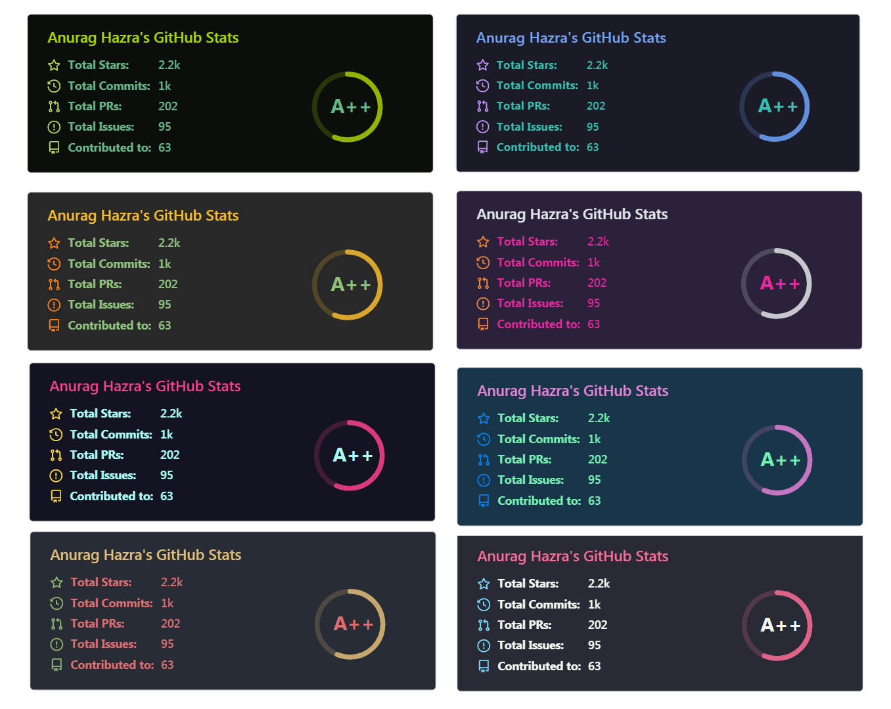
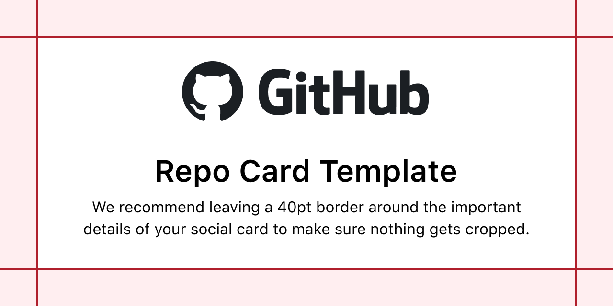

# 👋 Hello，World！
743859910/743859910 是一个 ✨特殊的✨ 存储库，您可以使用它来添加一个README.md到您的 GitHub 配置文件。确保它是公开的，并使用README对其进行初始化以开始使用。

<!--
**743859910/743859910** is a ✨ _special_ ✨ repository because its `README.md` (this file) appears on your GitHub profile.

Here are some ideas to get you started:

- 🔭 I’m currently working on ...
- 🌱 I’m currently learning ...
- 👯 I’m looking to collaborate on ...
- 🤔 I’m looking for help with ...
- 💬 Ask me about ...
- 📫 How to reach me: ...
- 😄 Pronouns: ...
- ⚡ Fun fact: ...
-->

---

<b>743859910</b>

 

---

      

---

  
  
  
  
  
  
  
  
  
  
  
  
  
  
  
  
  
  

---

# ✍ 博客与写作

> QQ：743859910

> 昵称：我只是你的过客

> 职业：互联网/个体工商户

> 公司：我只是你的过客工作室

> 个性签名：每个人都是每个人的过客

> 国籍：中华人民共和国 / 现居：中国湖北省武汉市

> 电子邮箱：743859910#qq.com（请自行将#更换为@）

> 我的个人官网 主域名：https://www.example.cn/ 规划建设中...

---

# ✍ 关于我

懒癌/强迫症/拖延症/ 三合一晚期患者(已弃疗)

20世纪90年代初期；本人搭上了九零后列车的第三节车厢；来到了这个所谓的21世纪；从2005年开始涉足互联网；

对网站建设略懂一二，对电子商务一知半解！

擅长 Ai、Fw、Fl、Br、Ae、Pr、Id、PS 等软件的安装与卸载；

2010年开始做淘宝，截至目前仍然是一家个体工商户法人、三家商贸公司法人、三家商贸公司股东；

网络时代的爬虫，熟悉 Halo、Hexo、Ghost、Z-blog、Discuz、MacCMS、Typecho、PHPwind、WordPress 等开源程序；

精通 C、C#、CSS、PHP、java、Lisp、C＋＋、Python、Ruby、Perl、JavaScript、Objective-C、ActionScript 等单词的拼写；

熟悉 IOS、Unix、Linux、MacOS、Android、SteamOS、HyperOS、Windows、ChromeOS、HarmonyOS、HarmonyOS NEXT 等系统的开关机；

更是 迅雷、腾讯、优酷、爱奇艺、美团、京东、拼多多、阿里云盘、百度云盘、哔哩哔哩 等多家平台VIP会员/SVIP会员，其实我也想低调，但实力不允许啊...

新的故事每天都还在继续...

---

 

---

# Multilingual

| [简体中文-中国大陆](./README-zh-cn.md) | [繁体中文-中国香港](./README-zh-hk.md) | [繁体中文-中国澳门](./README-zh-mo.md) | [繁体中文-中国台湾](./README-zh-tw.md) |
| :------------------------------------: | :------------------------------------: | :------------------------------------: | :------------------------------------: |

---

# 📈 GitHub 统计

|  |  |
| :----------------------------------------------------------: | :----------------------------------------------------------: |

---

# 📈 GitHub 统计主题

---

# 📈 GitHub 账户信息统计

---

|      |      |
| :--: | :--: |
|  |  |
|  |  |
|  |  |
|  |  |
|  |  |

---

# 技术栈

 

   
 

---

# 🔧 技术与工具

<table>
    <tr>
        <td >

        

        </td>
    </tr>
</table>

---

# ⭐️ Star History

<a href="https://star-history.com/#743859910/743859910&Date">
  <picture>
    <source media="(prefers-color-scheme: dark)" srcset="https://api.star-history.com/svg?repos=743859910/743859910&type=Date&theme=dark" />
    <source media="(prefers-color-scheme: light)" srcset="https://api.star-history.com/svg?repos=743859910/743859910&type=Date" />
    
  </picture>
</a>

---

# ⭐️ Star History

  

---

# ⭐️ Star 趋势

---

# ⭐️ Star History

<picture>
  <source media="(prefers-color-scheme: dark)" srcset="https://api.star-history.com/svg?repos=743859910/743859910&type=Date&theme=dark" />
  <source media="(prefers-color-scheme: light)" srcset="https://api.star-history.com/svg?repos=743859910/743859910&type=Date" />
  
</picture>

---

# ⭐️ Star History

---

# 免责声明：

- 本项目的所有功能都是基于互联网上公开的资料开发，无任何破解、逆向工程等行为。
- 本项目仅用于学习交流编程技术，严禁将本项目用于商业目的。如有任何商业行为，均与本项目无关。
- 如果本项目存在侵犯您的合法权益的情况，请及时与开发者联系，开发者将会及时删除有关内容。
- 本程序为免费开源项目，旨在分享网盘文件，方便下载以及学习golang，使用时请遵守相关法律法规，请勿滥用；
- 本程序通过调用官方sdk/接口实现，无破坏官方接口行为；
- 本程序仅做302重定向/流量转发，不拦截、存储、篡改任何用户数据；
- 在使用本程序之前，你应了解并承担相应的风险，包括但不限于账号被ban，下载限速等，与本程序无关；
- 如有侵权，请通过[邮件](743859910#qq.com)与我联系，会及时处理。

---

# 许可

Ultralytics 提供两种许可选项以适应各种用例：

- **AGPL-3.0 许可**：这是一个 [OSI 批准](https://opensource.org/license) 的开源许可，适合学生和爱好者，促进开放协作和知识共享。有关详细信息，请参阅 [LICENSE](https://github.com/ultralytics/ultralytics/blob/main/LICENSE) 文件。
- **企业许可**：专为商业使用设计，此许可允许将 Ultralytics 软件和 AI 模型无缝集成到商业产品和服务中，无需满足 AGPL-3.0 的开源要求。如果您的场景涉及将我们的解决方案嵌入到商业产品，请通过 [Ultralytics Licensing](https://www.ultralytics.com/license) 联系我们。

---

# 联系

如需 Ultralytics 的错误报告和功能请求，请访问 [GitHub Issues](https://github.com/ultralytics/ultralytics/issues)。成为 Ultralytics [Discord](https://discord.com/invite/ultralytics)、[Reddit](https://www.reddit.com/r/ultralytics/) 或 [论坛](https://community.ultralytics.com/) 的成员，提出问题、分享项目、探讨学习讨论，或寻求所有 Ultralytics 相关的帮助！

---

# 赞助🧧

贝宝（PayPal）
支付宝（Alipay）
微信支付（WeChat Pay）

🎁 *您的支持是我不断前进的动力！* 💖

  
  </a>

*我非常感谢您的赞赏和支持，它们将极大地激励我继续创新，持续产生有价值的工作。*

---

# 赞助者

---

# 贡献者

---

  
  </a>

  
  </a>

  
  </a>

  
  </a>

  
  </a>

---

昵称：我只是你的过客

个性签名：每个人都是每个人的过客

国籍：中华人民共和国 / 现居：中国湖北省武汉市

---

[MIT License](https://github.com/743859910/743859910/blob/master/LICENSE)

Copyright © 2008 - 2026 743859910. All Rights Reserved. 我只是你的过客工作室. 版权所有

---
